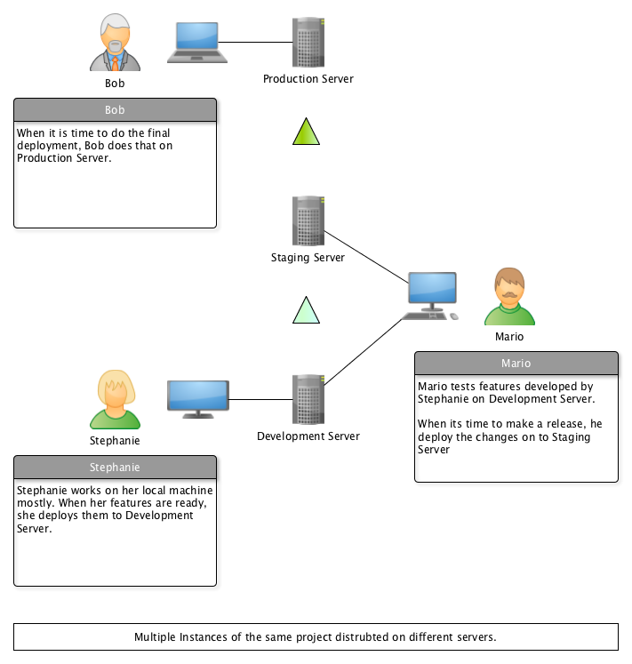
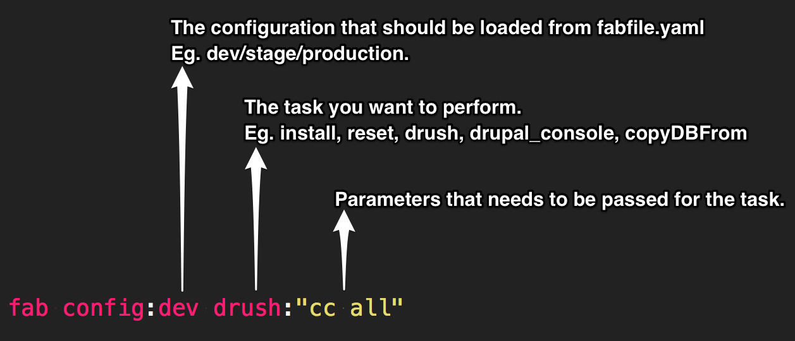

## Managing multiple instances of Drupal using fabalicious powered by fabric

### Scenario



Lets look at a typical deployment cycle that we follow on Drupal installations,

1. `SSH` : into development server
2. `TERMINAL` : navigate to project root folder
3. `DRUSH` : put site into maintenance mode
4. `DRUSH` : take database backup
5. `GIT` : pull develop branch from upstream
6. `DRUSH` : run database updates
7. `DRUSH` : clear cache
8. `DRUSH` : turn off maintenance mode

These steps with very little variations is prefomed by Stephanie, Mario and Bob.

As the number of projects grew, so did the number of instances of Drupal we have to deploy and maintain.
And good luck if you are the Stephanie, Mario and Bob in your company.

### The Problem

* Needed some way to keep track of all the instances related to a particular project.
* Wanted somebody to take care of the mundane repititive task of deployment.

A *script* to automate the whole process is obviously helpful. We also needed something that would take care of running our script accross various servers.

Thats where fabric comes to help us.

### What is Fabric?

>Fabric is a Python (2.5-2.7) library and command-line tool for streamlining the use of SSH for application deployment or systems administration tasks.
>~ http://www.fabfile.org/

So after installing fabric, you can create two files inside your project folder.

- `fabfile.py` is where you would define your tasks.

- `fabfile.yaml` is where we would store our project specific configurations.

__This is so that we could reuse `fabfile.py` in other projects without hacking it everytime.__

So let say we create a task called **deploy** in `fabfile.py` and specified our configuration for development server in `fabfile.yaml` under key **develop**. Then we could simply do `fab config:develop deploy`. While the fabric runs all the deployment task for you. You can go, grab a coffee, or collect your dark elixers from Clash of Clans, or tell me what you did with the extra time you got in comments below.

Over time you keep on adding more and more tasks into fabfile.py and eventually start adding it as a submodule to every project.

Thats how [fabalicious](https://github.com/factorial-io/fabalicious) was born.

fabalicious is nothing other than the `fabfile.py`, that nice folks at [factorial.io](http://factorial.io/) created for internal use.

## Fabalicious

*Fabalicious* is specially crafted deployment script to help deploy drupal installations across different servers. It reads a yaml-file called `fabfile.yaml` where all project specific hosts are defined.

### Basic Usage Example.

Prerequisite:

* You have ssh access to the servers where you want to peform tasks.
* The individual components of tasks could be executed on the server.

When using fabalicious, all we need to do is populate the `fabfile.yaml` with details about the server.

Below is a populated fabfile.yaml for a typical setup involving development, staging and production server.

```yaml
name: myproject
requires: 2.0

deploymentModule: myproject_deploy

excludeFiles:
  backup:
    - "styles"
    - "tmp"
  copyFrom:
    - "tmp"
    - "styles"

hosts:
  dev:
    host: example.com
    type: dev
    user: root
    password: root
    port: 22
    # path to drupal's root folder
    rootFolder: /var/static/myproject/staging/public
    gitRootFolder: /var/static/myproject/staging/
    # path to the site's folder
    siteFolder: /sites/default
    filesFolder: /sites/default/files
    backupFolder: /var/static/myproject/staging/backups
    # branch to pull
    branch: develop
    supportsInstalls: true
    database:
      name: myproject
      user: root
      pass: admin
  stage:
    inheritsFrom: dev
    host: example.com
    type: stage
    # branch to pull
    branch: release/0.1.0
    rootFolder: /var/static/myproject/010/public
    gitRootFolder: /var/static/myproject/010/
    database:
      name: myproject_010
      user: root
      pass: admin
  production:
    host: production.com
    type: live
    user: root
    password: root
    port: 22
    # path to drupal's root folder
    rootFolder: /var/www/public
    gitRootFolder: /var/www/
    # path to the site's folder
    siteFolder: /sites/default
    filesFolder: /sites/default/files
    backupFolder: /var/www/backups
    # branch to pull
    branch: master
    supportsInstalls: false
    database:
      name: production
      user: root
      pass: admin
```

Then we could,

* `fab config:dev deploy` : Deploy on development server.
* `fab config:stage copyDBFrom:production` : Copy database from production to staging.
* `fab config:stage drush:"cc all"` : To execute a drush command on staging to clear cache.
* and so on ...



Many common tasks like deployment, reset, install, drush, drupalConsole, backup, copyFrom, copyDBFrom, etc are already supported.

__NOTE: `git`, `drush` and `drupal_console` has to be present in remote installation to be able to use them__

Fabalicious also has some exclusive support for [multibasebox](https://github.com/factorial-io/multibasebox), which helps you to serve multiple docker container with the help of haproxy from one vagrant-host.


Please [visit the project page of fabalicious](https://github.com/factorial-io/fabalicious) to know what all tasks have already been implemented.

### Conclusion

For those who don't want to get their hands dirty in scripting, fabalicious provides a decent set of tasks that you could perform with fabric on Drupal sites.
